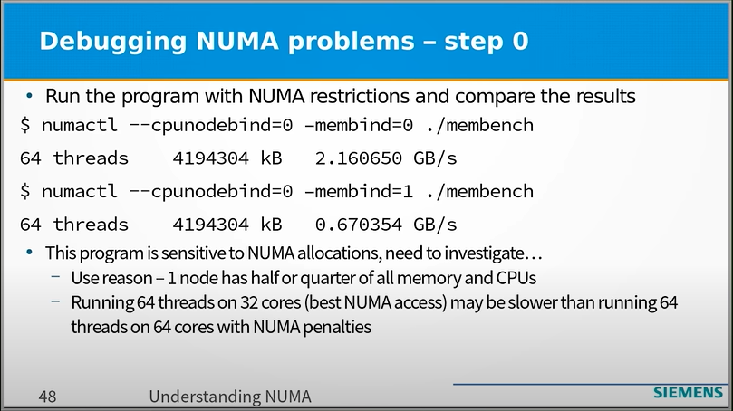

## [Non-Uniform Memory Architecture (NUMA): A Nearly Unfathomable Morass of Arcana - Fedor Pikus CppNow](https://www.youtube.com/watch?v=f0ZKBusa4CI)

numactl --cpunodebind=0 -membind=0 ./membench
numactl --cpunodebind=0 -membind=1 ./membench

