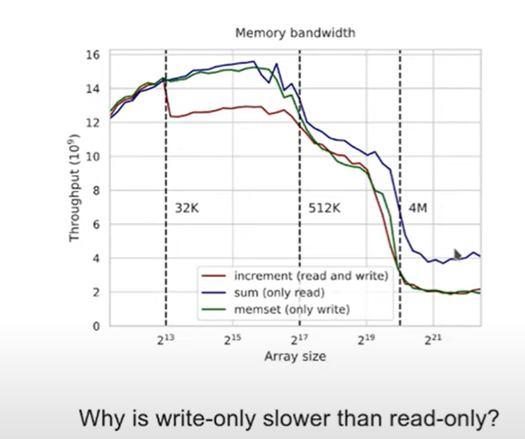

## two important things:
* Latency
* Bandwidth





write-only will be slower than read-only and same as read-write.
this is because Write-only needs to update cache(likely L3), requesting a read and doubling the RAM-CPU
traffic.

---
The solution is bypassing caches.
look at the code for more details.

---
## 4. Latency
To understand latency we need pointer chasing.
The results:
* after you'll have more memory than L3 cache(4M in our example) the perf will be much worse.
* If you will make cpu frequency go up from 2 to 4GHz the perf will ~almost double when data is
	small enough to be in L3 cache and very small speedup when it's more than L3.

## 5. Cache Lines
* The cache line is 64 bytes.
```C++
void test1(int D = 1) {
	for (int i = 0; i < N; i += D)
		a[i]++;
	}
```
D = 16 needs 1 scalar instruction
2x faster if data is in L1.
when data is bigger than L2, the perf will not be visible.

D = 1  needs 2 vector instructions

**Tip: measure memory in terms of cache lines**
**Tip: use memory alignment to minimize cache line fetches**

---
**lstopo on linux will show the numa nodes and memory**
### Option 1:
** parallel taskset -c 0,1,2,3 ./app ::: {0..3}**
will run 4 processes on first 4 cores

### Option 2:
**numactl --interleave=all ./app**
	
•	--cpunodebind=<nodes>: This option binds the process to the CPUs of the specified node(s).
	The <nodes> parameter is a comma-separated list of node numbers.
•	--membind=<nodes>: This option binds the process to the memory of the specified node(s).
	The <nodes> parameter is a comma-separated list of node numbers.
•	--preferred=<node>: This option sets the preferred node for memory allocation.
	The process will allocate memory from this node as long as there is free memory available.
•	--localalloc: This option sets the local allocation policy, which means the process
	will allocate memory on the node where it is currently executing.
•	--physcpubind=<cpus>: This option binds the process to the specified CPUs.
	The <cpus> parameter is a comma-separated list of CPU numbers.
•	--show: This option shows the NUMA policy settings of the current process.
•	--hardware: This option shows the available NUMA nodes and their associated CPUs
	and memory.

---
### [Non-Uniform Memory Architecture (NUMA): A Nearly Unfathomable Morass of Arcana - Fedor Pikus CppNow](https://www.youtube.com/watch?v=f0ZKBusa4CI)

**Performance implications of NUMA**
* Accessing local memory is different from accessing non-local memory.
* To access memory from another node, the node's CPU must be involved.
* Peak bandwidth is reduced by 40% to 60% for cross node access.
	- This is remarkably universal for x86 hardware from 2014 to 2022.
	- Some systems show degradation for even 1 thread, some do not.
	- Newer systems have higher bandwidth, but larger penalty.
* Cache bandwidth is not affected (without data sharing).
* Memory bandwidth is measured by sequential data transfers.

***Even when two cores in different nodes are accessing memory in the same page, the memory access is slower.***
***If all cores access memory in the same page, then the slowdown is 20 to 100x times.***


#### Intel has memory latency checker.
mlc --latency_matrix -e -r

**To find out numa related issues:**
1. numactl --hardware
1. numactl --cpunodebind=0 ./app args...
1. numactl --membind=0 ./app args...
1. numactl --interleave=all ./app args...


**Performance of a single atomic operation often shows some slowdown on NUMA systems.**
	- Especially on Read-Modify-Write operations.
	- Usually not for atomic load or store (so RCU algorithms may have advantage)
	- Intel QPI systems may not show any slowdown at all.
	- AMD Epyc systems show little to none NUMA penalty.

* Most concurrent data structures and executors use shared variables and atomic operations.
	- locks too (usually atomic exchange)
* Maintaining consistent global shared state on NUMA systems is very expensive.

** NUMA programming api allows very fine control of thread and memory interactions with NUMA hardware.**

#include <numa.h>
#include <numaif.h>
* Restrict the calling thread to a subset of NUMA nodes or CPUs.
* numa_run_on_node(), numa_sched_set_affinity()
also pthread_setaffinity_np() from pthreads library.
* Restrict memory allocations by the calling thread to specific NUMA nodes
numa_set_preferred(), set_mempolicy()
* Functions for direct allocations on the specified node, moving memory between nodes,
 querying current NUMA policies and hardware capabilities.
* Caution: cpu-to-node mapping is SLOOOW (cache cpu maps and masks)


To find to what node the Device is connected:
/sbin/lspci
04:00.0 Ethernet controller: Intel Corporation 82599ES...
Then run below command
cat /sys/bus/pci/devices/0000\:04\:00.0/numa_node
0

Sometimes you can get perf improvement up to 20% by moving the device to the same node as the CPU.
This related to what Fedor found.

** GPUs are a special case of I/O**
	- GPU interfaces are usually faster than any other device.
	- Data transfer is often the bottleneck of GPU acceleration.
* CUDA bandwidth test for Tesla V100: 10GB/s(node 0) vs 7GB/s(node 1)
* If GPU-CPU transfer is a concern, pinned memory should be used
	- Pinned memory will override NUMA policy.
* Pinned memory is on the GPU node
	- At least by default.
	- Transfer rate is 13GB/s


** TLB shootdown**
Basically after page get's mapped to another node, the TLB needs to be invalidated.
kernel will halt all processes and update TLBs on all CPUs.(TLB is per CPU)

---