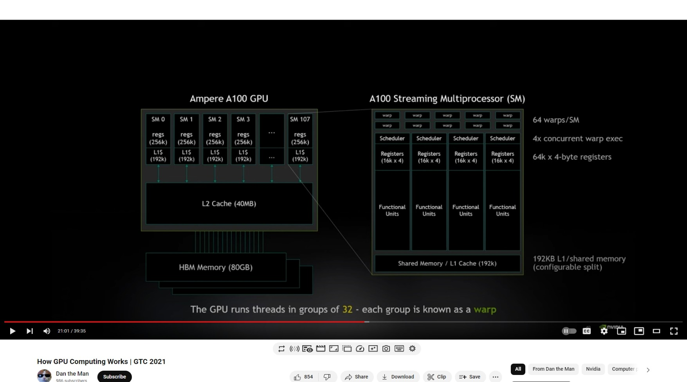
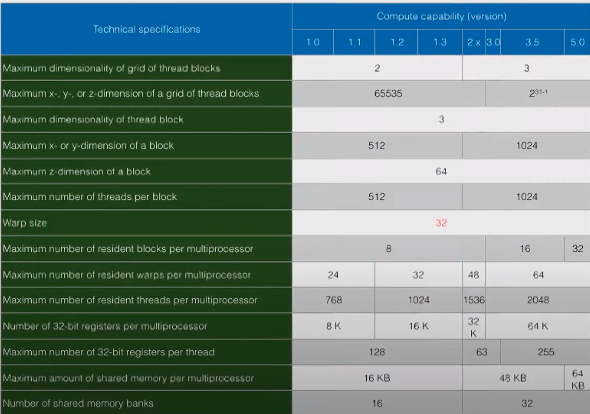

# How GPU Computing Works | GTC 2021(https://www.youtube.com/watch?v=3l10o0DYJXg)




The gpu run threads in groups of 32 - each group is known as a warp.
There are 64warps/SM.
4concurrent warp exec.

---             Per SM--On A100
Total threads   2048    221,184
Total Warps     64      6,912
Active Warps    4       432
Waiting Warps   60      6,480
Active Threads  128     13,824
Waiting Threads 1,920   207,360

The gpu can switch from one warp to the next in a **single clock cycle**

---
Cuda Limitations:
Maximum dimensionality of grid of thread blocks | on newer versions 3 was 2 on 1.x versions.
Maximum x,y,or z-dimension of a grid of thread blocks. 2^31-1
Maximum dimensionality of a thread block. 3
Maximum x or y-dimensions of a block.


```bash
# code example repo:
git clone https://github.com/tcew/ATPESC17
cd ATPESC17/examples/cuda/simple
nvcc -o simple simple.cu
./simple
```
---
