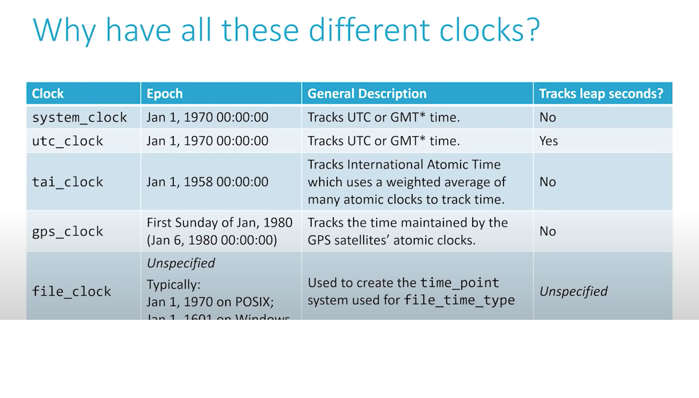

## Clocks


## **clock_cast**
Allows you to convert time_point for one clock to an equivalent
time_point for another clock
Internally, uses clock_time_conversions which each use
**to_utc, from_utc, to_sys and from_sys** as needed.


## **Leap Seconds**
a one-second time adjustment that is occasionally applied to UTC
time to accommodate the discrepancies that develop
between precise time and observed solar time.

* c++17 added: system_clock, file_clock
* c++20 added: utc_clock, tai_clock, gps_clock, file_clock(new feature)

system_clock Jan 1 1970 00:00:00, Tracks UTC or GMT* time.
utc_clock    Jan 1 1970 00:00:00, Tracks UTC or GMT* time. Tracks Leap seconds

tai_clock Tracks International Atomic Time Jan 1 1958 00:00:00
gps_clock Tracks GPS time Jan 6 1980 00:00:00

file_clock has 2 epochs: Jan 1 1970 00:00:00 On POSIX and Jan 1 1601 00:00:00 On Windows
		used to create time_point system used for file_time_type, Tracks Leaps seconds (Unspecified)

'''C++
https://github.com/CppCon/CppCon2021/blob/main/Presentations/Cpp20_Chrono.pptx
https://www.youtube.com/watch?v=Dq7rqjatxz8
void Clock_Examples()
{
	
	tai_time tai_now = tai_clock::now();
	std::cout << tai_now << "\n";

	utc_time utc_now = clock_cast<utc_clock>(tai_now);
	std::cout << utc_now << "\n";

	// above have difference of 37 seconds
	// This is because:
	// * there is a 10 second offset between TAI and UTC
	// * there have been 27 leap seconds since 1970
}
```


